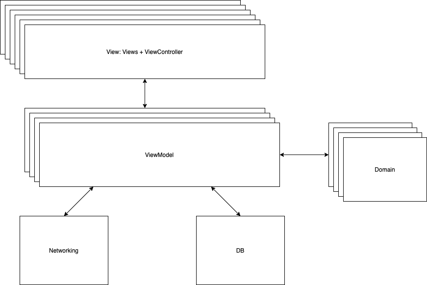

# FlipDishMenu
An app to display a menu

## Branches:

* master - stable app releases

## Dependencies:

The project is not using any third party cocoapods for managing external libraries

## Project structure:

  

* ViewModel: viewmodel objects with all business logic
* Model: data model objects
* Support: resuseable classes
* Networking Service: Generic Networking Layer

## Next step:

*  Add unit test
*  Fix the image contort problem
*  Beautify the UI

## Author:

*  Qi Li

## Contact:

* https://www.linkedin.com/in/lee-qi/
* www.leeqii.com
